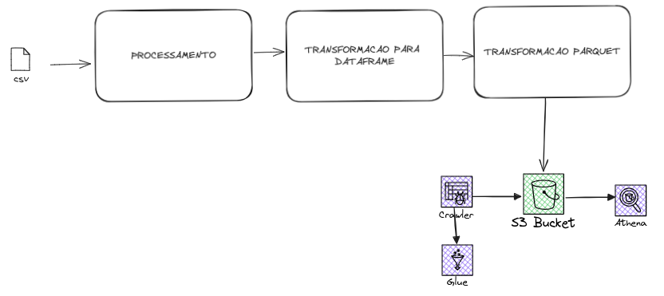
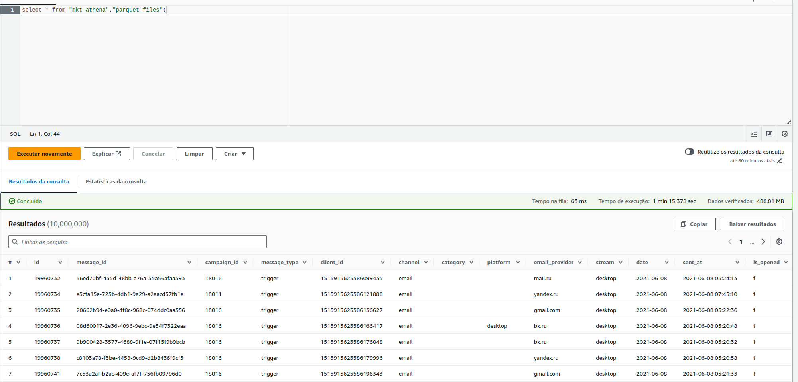

# mkt-campaign-etl


## DESCRIÇÃO
Este projeto é sobre explorar os serviços da AWS S3, Glue (crawler) e Athena em um arquivo de 10MM de linhas

## ARQUIVOS
`messages-demo.csv` contém mensagens de campanhas de marketing de uma empresa de médio porte na Rússia de 2021 a 2023 - 2GB


## WORKFLOW


## ETAPAS

1. Obtendo o dataset: https://www.kaggle.com/datasets/mkechinov/direct-messaging
2. Configurar AWS CLI e key: https://docs.aws.amazon.com/cli/latest/userguide/getting-started-install.html
3. `etl.py`: transforma o dataset em json e em seguida para parquet para então carregar no bucket S3
4. Glue: Criar database
5. Glue: Criar crawler
6. Athena: Realizar queries


## RESULTADO



## APRENDIZADOS
- Configurar AWS CLI
- Preparar o ambiente para uso do serviço
- Entender funcionalidades do Glue: mapear schemas e consultar os dados parquet usando SQL;


## ESTRUTURA DO PROJETO
```.
├── data
│   ├── processed
│   │   ├── messages-demo.json
│   │   └── messages-demo.parquet
│   └── raw
│       ├── campaigns.csv
│       └── messages-demo.csv
├── image-1.png
├── image.png
├── main.py
├── operation_elt_time.txt
├── poetry.lock
├── pyproject.toml
├── README.md
├── src
│   ├── etl.py
│   └── __pycache__
│       └── elt.cpython-312.pyc
└── tests
    └── testando_db.py
```